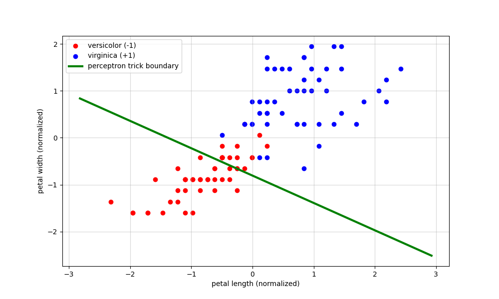
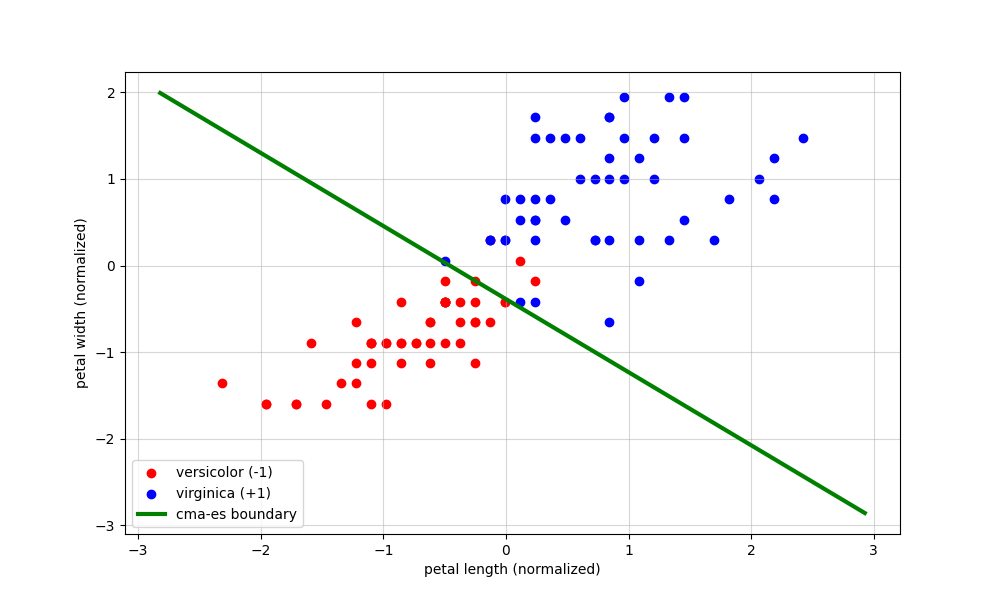

# perceptron trick vs cma-es

## project overview
This project compares the classic perceptron trick algorithm against the CMA-ES

The goal is to demonstrate the fundamental limitation of the perceptron trick when dealing with noisy or overlapping data, and how an evolutionary, gradient-free approach like CMA-ES can find a robust solution where the perceptron fails.

## the experiment
I used the Iris Dataset (only versicolor and virginica as classes and petal length and width as visualization is possible with 2 classes and 2 features) 

challenge: These two flower classes have a slight overlap, making them non-linearly separable

## results
| Algorithm | Accuracy | Outcome |
| :--- | :--- | :--- |
| **perceptron trick** | **~83%** | failed to find optimal decision boundary |
| **CMA-ES** | **~97%** | quickly converged to the correct decision boundary|

## visual comparison

| **perceptron trick (traditional)** | **CMA-ES (evolutionary)** |
| :---: | :---: |
|  |  |

